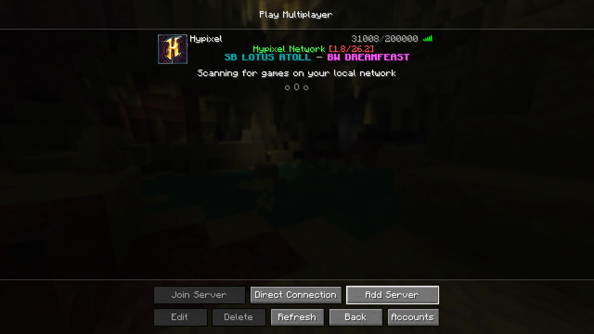
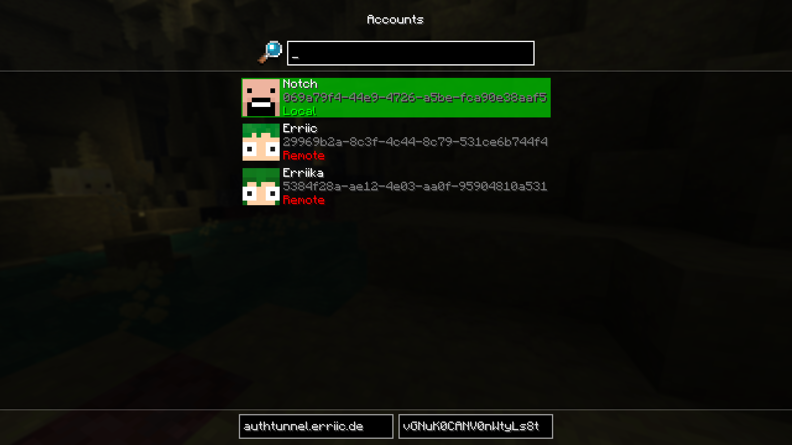

# Auth Tunnel (Minecraft Mod)

Latest release: [Get the newest release here](https://github.com/erriicgit/auth-tunnel/releases)  
(Replace the link above with the correct release URL for this repository.)

## What is this?

Auth Tunnel is a Minecraft client mod that adds an account selector for remote accounts hosted on an AuthTunnel server. Instead of storing multiple accounts locally, this mod lets you pick from accounts provided by a running AuthTunnel server.

Important: This project is in very early development and is expected to be unstable and full of bugs. Use at your own risk.

## Screenshots

## Requirements

- A compatible Minecraft client (see mod build / distribution for supported versions)
- An AuthTunnel server running and reachable from the client. (I will link the AuthTunnel server repository and releases here later.)

## Quick start

1. Install the mod into your Minecraft `mods` folder (or follow your mod loader's installation instructions).
2. Start an AuthTunnel server and ensure it is reachable from your client machine.
3. Launch Minecraft. Open the Auth Tunnel account selector in the mod options or the account menu and add the remote server address as well as the api key.
4. Select a remote account from the list and log in.

If you need the server software, see the repository link above (to be added). For now, you can use the releases link at the top to get the latest client build.

## Configuration

The mod expects an AuthTunnel server URL and optional credentials (depending on server configuration). Typical settings you may need to provide:

- Server URL (e.g. `auth.example.com`)
- API key or token (if your server requires one)

Configuration can be entered in the mod UI or via the mod configuration file in the Minecraft `config/` directory.

## Known issues and stability

- Early development: expect crashes and data loss — please back up any important files.
- Network interruptions while switching accounts may produce unexpected behavior.
- Not all Minecraft versions or mod loaders are supported yet.

If you encounter problems, please open an issue with logs and a clear description of steps to reproduce.

## Troubleshooting

- If accounts don't show up: verify the server URL is correct and reachable from the client machine.
- If login fails: check server logs and ensure any required API keys or tokens are correct.
- Crashes on startup: remove the mod from `mods/` and test; provide crash logs when reporting issues.

## Contributing

Contributions, bug reports and feature requests are welcome. When opening issues or pull requests, please include:

- A clear description of the problem or feature
- Minecraft/mod loader version and mod version
- Steps to reproduce and any relevant logs (client side & server side)

I will add a link to the AuthTunnel server repository soon.
